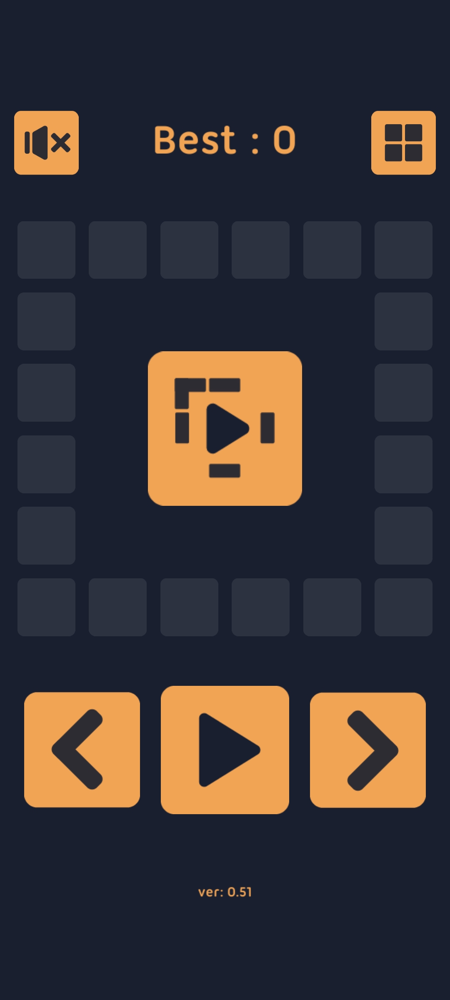
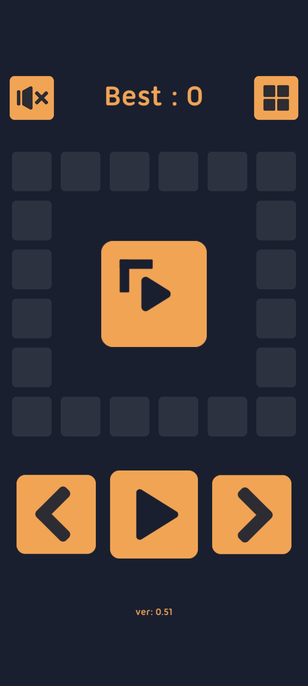
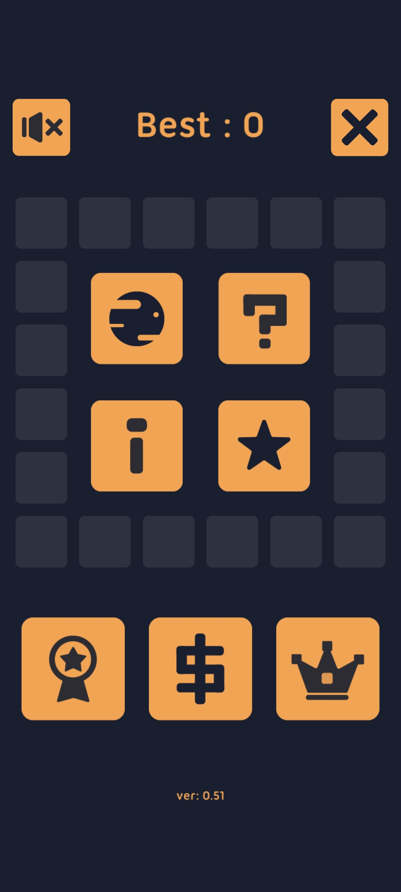
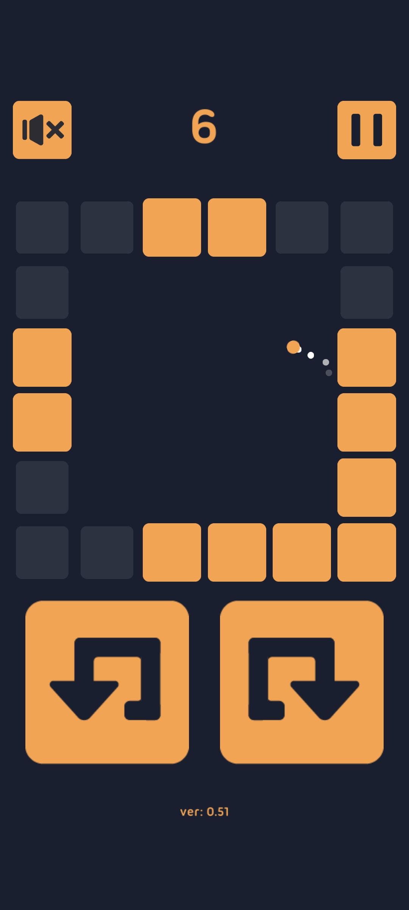
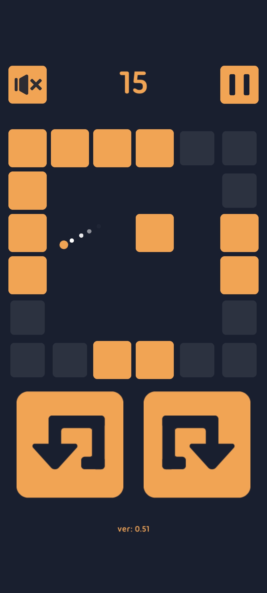
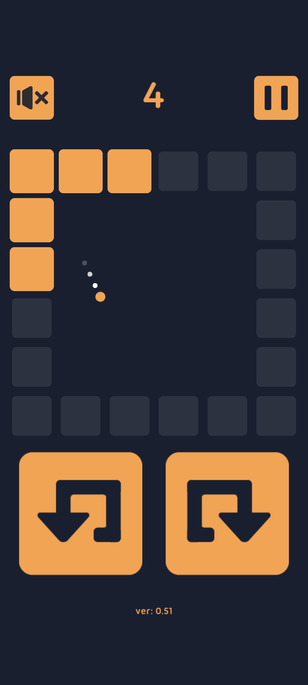
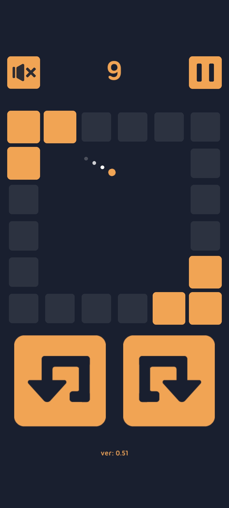

# Keep Pong

### 遊玩方式
玩家要操控左轉或右轉的按鈕切換牆壁，讓球不斷保持在牆內，當球打擊到牆壁時即可加分。

隨著分數增加場地內會出現方塊增加難度。

遊戲總共有三種不同的牆壁模式可以遊玩。

### 連結
[apk 下載連結](https://drive.google.com/file/d/1OKwLEmDghRxRGG-_lPB-ozfNSWu20cWc/view?usp=drive_link)

### 圖片

* 主畫面

 

* 選單

* 遊戲畫面

  

* 不同模式

  
